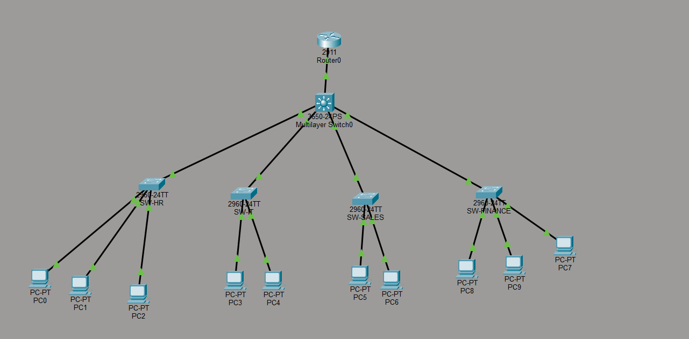

# 🏢 Enterprise Office Network Design

> A fully functional enterprise-grade network simulation built using Cisco Packet Tracer — featuring VLAN segmentation, inter-VLAN routing, port security, SSH access, and DHCP.

---

## 👥 Team Members

 AmaanAli Motiwala | [@AmaanaliMotiwala0109](https://github.com/AmaanaliMotiwala0109) |
 Vedant Patel | [@Vedantp29](https://github.com/Vedantp29) |

---

## 📌 Project Overview

This project simulates a real-world enterprise office network for a company with 4 departments — **HR, IT, Sales, and Finance**. Each department is isolated in its own VLAN for security and traffic management, while still being able to communicate through a centralized multilayer switch acting as the Layer 3 routing core.

---

## 🗺️ Network Topology



---

## 📋 VLAN Configuration

| VLAN | Department | Subnet           | Default Gateway | Hosts         |
|------|------------|------------------|-----------------|---------------|
| 10   | HR         | 192.168.10.0/24  | 192.168.10.1    | PC0, PC1, PC2 |
| 20   | IT         | 192.168.20.0/24  | 192.168.20.1    | PC3, PC4      |
| 30   | Sales      | 192.168.30.0/24  | 192.168.30.1    | PC5, PC6      |
| 40   | Finance    | 192.168.40.0/24  | 192.168.40.1    | PC7, PC8, PC9 |

---

## 🔌 Physical Interface Mapping

| Core Switch Port | Connected To      | Access Switch Port | VLAN Allowed |
|------------------|-------------------|--------------------|--------------|
| Gi1/0/1          | Router0           | —                  | 10,20,30,40  |
| Gi1/0/2          | Switch0 (HR)      | Fa0/1              | 10           |
| Gi1/0/3          | Switch1 (IT)      | Fa0/3              | 20           |
| Gi1/0/4          | Switch2 (Sales)   | Fa0/3              | 30           |
| Gi1/0/5          | Switch3 (Finance) | Fa0/4              | 40           |

---

## ✨ Features

- 🔒 **VLAN Segmentation** — Each department isolated in its own VLAN
- 🔁 **Inter-VLAN Routing** — Layer 3 routing via Multilayer Switch SVIs
- 🔐 **Port Security** — Sticky MAC address, max 1 device, shutdown on violation
- 🛡️ **SSH Access** — Secure remote management on all switches
- 📡 **DHCP** — Automatic IP assignment per VLAN (configured on Router0)
- 🌲 **Trunk Links** — 802.1Q trunking between core and access layer
- 🚧 **ACL** — HR department blocked from accessing Finance (VLAN 40)
- 🖧 **Management VLAN Interfaces** — Remote switch management using VLAN IP addresses

---

## 🖥️ Device Configurations


### 1. Router0 — Cisco 2811 (DHCP)

```bash
enable
configure terminal
hostname Router0

! ── Trunk interface toward Core Switch ──
interface fa0/0
 no shutdown
interface fa0/0.10
 encapsulation dot1Q 10
 ip address 192.168.10.254 255.255.255.0
interface fa0/0.20
 encapsulation dot1Q 20
 ip address 192.168.20.254 255.255.255.0
interface fa0/0.30
 encapsulation dot1Q 30
 ip address 192.168.30.254 255.255.255.0
interface fa0/0.40
 encapsulation dot1Q 40
 ip address 192.168.40.254 255.255.255.0

! ── DHCP Pools ──
ip dhcp excluded-address 192.168.10.1 192.168.10.10
ip dhcp excluded-address 192.168.20.1 192.168.20.10
ip dhcp excluded-address 192.168.30.1 192.168.30.10
ip dhcp excluded-address 192.168.40.1 192.168.40.10

ip dhcp pool HR
 network 192.168.10.0 255.255.255.0
 default-router 192.168.10.1
 dns-server 8.8.8.8

ip dhcp pool IT
 network 192.168.20.0 255.255.255.0
 default-router 192.168.20.1
 dns-server 8.8.8.8

ip dhcp pool SALES
 network 192.168.30.0 255.255.255.0
 default-router 192.168.30.1
 dns-server 8.8.8.8

ip dhcp pool FINANCE
 network 192.168.40.0 255.255.255.0
 default-router 192.168.40.1
 dns-server 8.8.8.8

end
write memory
```
### 2. CORE-SW — Multilayer Switch0 (Cisco 3650 + ACL)

```bash
enable
configure terminal
hostname CORE-SW
vlan 10
 name HR
vlan 20
 name IT
vlan 30
 name SALES
vlan 40
 name FINANCE
interface gi1/0/1
 switchport mode trunk
 switchport trunk allowed vlan 10,20,30,40
 no shutdown
interface gi1/0/2
 switchport mode trunk
 switchport trunk allowed vlan 10
 no shutdown
interface gi1/0/3
 switchport mode trunk
 switchport trunk allowed vlan 20
 no shutdown
interface gi1/0/4
 switchport mode trunk
 switchport trunk allowed vlan 30
 no shutdown
interface gi1/0/5
 switchport mode trunk
 switchport trunk allowed vlan 40
 no shutdown
ip routing
interface vlan 10
 ip address 192.168.10.1 255.255.255.0
 no shutdown
interface vlan 20
 ip address 192.168.20.1 255.255.255.0
 no shutdown
interface vlan 30
 ip address 192.168.30.1 255.255.255.0
 no shutdown
interface vlan 40
 ip address 192.168.40.1 255.255.255.0
 no shutdown
ip domain-name company.local

! ── ACL: Block HR from accessing Finance ──
 ip access-list extended BLOCK_HR_TO_FINANCE 
      deny ip 192.168.10.0 0.0.0.255 192.168.40.0 0.0.0.255
       permit ip any any

 interface vlan 10
    ip access-group BLOCK_HR_TO_FINANCE in    
crypto key generate rsa modulus 2048
username admin privilege 15 secret StrongPass123
line vty 0 4
 login local
 transport input ssh
end
write memory
```

---

### 3. SW-HR — Switch0 (VLAN 10)

```bash
enable
configure terminal
hostname SW-HR
vlan 10
 name HR
interface fa0/1
 switchport mode trunk
 switchport trunk allowed vlan 10
 no shutdown
interface range fa0/2 - 4
 switchport mode access
 switchport access vlan 10
 switchport port-security
 switchport port-security maximum 1
 switchport port-security violation shutdown
 switchport port-security mac-address sticky
 no shutdown
ip domain-name company.local
crypto key generate rsa modulus 2048
username admin privilege 15 secret StrongPass123
line vty 0 4
 login local
 transport input ssh
! ── Management VLAN Interface ── 
interface vlan 10
    ip address 192.168.10.250 255.255.255.0 
    no shutdown
ip default-gateway 192.168.10.1
end
write memory
```

### 4. SW-IT — Switch1 (VLAN 20)

```bash
enable
configure terminal
hostname SW-IT
vlan 20
 name IT
interface fa0/1
 switchport mode trunk
 switchport trunk allowed vlan 20
 no shutdown
interface range fa0/2 - 3
 switchport mode access
 switchport access vlan 20
 switchport port-security
 switchport port-security maximum 1
 switchport port-security violation shutdown
 switchport port-security mac-address sticky
 no shutdown
ip domain-name company.local
crypto key generate rsa modulus 2048
username admin privilege 15 secret StrongPass123
line vty 0 4
 login local
 transport input ssh
! ── Management VLAN Interface ── 
interface vlan 20 
   ip address 192.168.20.250 255.255.255.0 
   no shutdown
ip default-gateway 192.168.20.1
end
write memory
```

### 5. SW-SALES — Switch2 (VLAN 30)

```bash
enable
configure terminal
hostname SW-SALES
vlan 30
 name SALES
interface fa0/1
 switchport mode trunk
 switchport trunk allowed vlan 30
 no shutdown
interface range fa0/2-3
 switchport mode access
 switchport access vlan 30
 switchport port-security
 switchport port-security maximum 1
 switchport port-security violation shutdown
 switchport port-security mac-address sticky
 no shutdown
ip domain-name company.local
crypto key generate rsa modulus 2048
username admin privilege 15 secret StrongPass123
line vty 0 4
 login local
 transport input ssh
! ── Management VLAN Interface ── 
interface vlan 30
    ip address 192.168.30.250 255.255.255.0
    no shutdown
ip default-gateway 192.168.30.1
end
write memory
```

### 6. SW-FINANCE — Switch3 (VLAN 40)

```bash
enable
configure terminal
hostname SW-FINANCE
vlan 40
 name FINANCE
interface fa0/1
 switchport mode trunk
 switchport trunk allowed vlan 40
 no shutdown
interface range fa0/2 - 4
 switchport mode access
 switchport access vlan 40
 switchport port-security
 switchport port-security maximum 1
 switchport port-security violation shutdown
 switchport port-security mac-address sticky
 no shutdown
ip domain-name company.local
crypto key generate rsa modulus 2048
username admin privilege 15 secret StrongPass123
line vty 0 4
 login local
 transport input ssh
! ── Management VLAN Interface ── 
interface vlan 40 
   ip address 192.168.40.250 255.255.255.0 
   no shutdown
ip default-gateway 192.168.40.1
end
write memory
```

---

## ✅ Verification Commands

```bash
! ── On Core Switch ──
show ip interface brief       ! Check all SVIs are up
show vlan brief               ! Confirm VLANs exist
show interfaces trunk         ! Verify trunk links are active
show ip route                 ! Check routing table

! ── On Router ──
show ip dhcp binding          ! See all DHCP-assigned IPs

! ── On CORE-SW ──
 show access-lists ! Check ACL hit counters 
 show running-config ! Verify ACL applied on VLAN 10

! ── From any PC (Command Prompt) ──
ipconfig                      ! Should show a DHCP IP in correct range
ping 192.168.10.11            ! Test connectivity within VLAN
ping 192.168.20.11            ! HR → IT (should WORK)
ping 192.168.40.11            ! HR → Finance (should FAIL due to ACL)
```

---

## 🛠️ Tools & Technologies

 Cisco Packet Tracer 8.x | Network simulation |
 Cisco 3650-24PS | Inter-VLAN Routing + ACL Enforcement |
 Cisco 2960-24TT | Access Layer Switches |
 Cisco 2811 Router | DHCP Server |
 SSH | Secure remote management |
 802.1Q Trunking | VLAN tagging between switches |

---

## 🚀 How to Run

1. Install **Cisco Packet Tracer 8.x** (free via [Cisco NetAcad](https://www.netacad.com/))
2. Clone this repository:
   ```bash
   git clone https://github.com/AmaanaliMotiwala0109/Enterprise-Office-Network-Design.git
   ```
3. Open `network_VLAN_congiguration_in_Cisco_Packet_Tracer.pkt` in Packet Tracer
4. Use the **Simulation Mode** to trace packets between departments
5. Open any PC terminal and run `ipconfig` to verify DHCP assignment

---

## 📂 File Structure

```
Enterprise-Office-Network-Design/
│
├── network_VLAN_congiguration_in_Cisco_Packet_Tracer.pkt
├── image.png
└── README.md
```

---

## 📄 License

This project is built for educational and academic purposes.

---

> Made with 💙 by [AmaanaliMotiwala0109](https://github.com/AmaanaliMotiwala0109) & [Vedantp29](https://github.com/Vedantp29)
